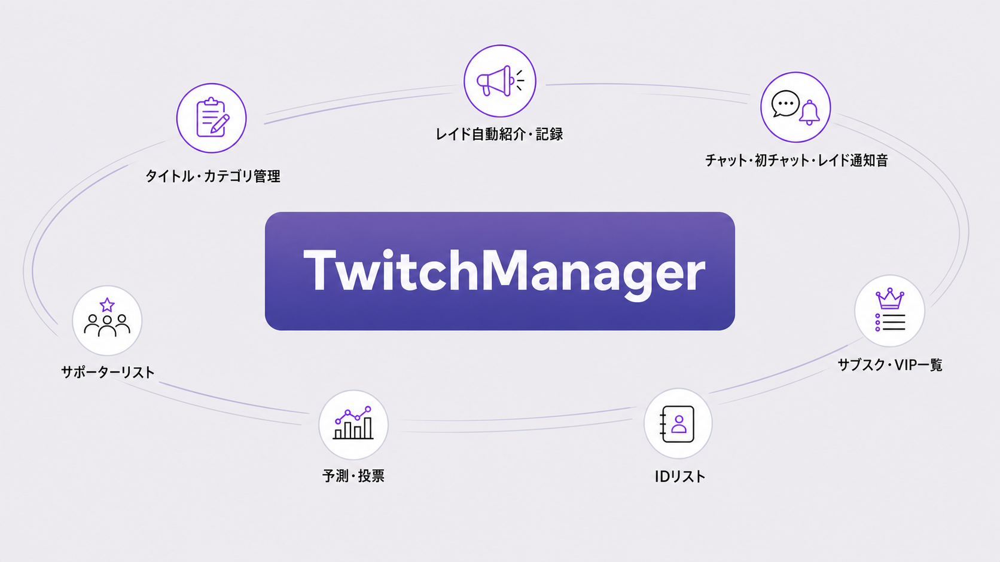
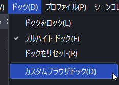

# TwitchManager

[日本語](README.md) | [English](README.en.md)

TwitchManager is a custom OBS Studio browser dock for preparing and managing Twitch streams, receiving notifications, and keeping viewer records in one place.

> TwitchManager is independently developed and shared free of charge in good faith, with the hope of supporting streamers. It is not an official Twitch or OBS Studio product.
>
> If you would like to support continued development, a [BOOTH support edition](https://toumei2suisai.booth.pm/items/8654630) with the same features and contents as the free edition is available.

**UI languages:** 日本語 / English / 简体中文

The latest version is available from [GitHub Releases](https://github.com/MagnestGames/TwitchManager/releases/latest).

## Main features

### Stream titles and categories

Save frequently used title and category pairs.  
Apply them to Twitch before a stream and avoid entering the same information again.

### Automatic raid introductions and ID records

Automatically introduce a channel when it raids you.  
Run the official `/shoutout` command and record the raider's Twitch ID.

### Chat and raid notification sounds

Play sounds for chats, first-time chatters, and incoming raids.  
Notice important activity without watching the screen continuously.

### Streamer and viewer management

- **Supporter list** — Records first-time chatters, raids, follows, Bits, subscriptions, chats, and channel point redemptions.
- **Subscriber and VIP lists** — Retrieves your channel's subscribers and VIPs.
- **ID list** — Saves and manages streamer IDs used for raids and introductions.

### Other stream support

- Send `/raid` and automatically post the destination channel URL.
- Manage predictions, polls, chat modes, clips, and VIPs.
- Keep birthdays, anniversaries, memos, and backups of settings and lists.

## Download

Open the [latest release](https://github.com/MagnestGames/TwitchManager/releases/latest) and download the installer for your operating system from **Assets**.

| OS | File to download |
| --- | --- |
| Windows 11 | [`TwitchManager-Windows11-Setup.exe`](https://github.com/MagnestGames/TwitchManager/releases/latest/download/TwitchManager-Windows11-Setup.exe) |
| macOS 11 or later | [`TwitchManager-macOS.pkg`](https://github.com/MagnestGames/TwitchManager/releases/latest/download/TwitchManager-macOS.pkg) |

`Source code (zip)` and `Source code (tar.gz)` are not installers.

## Installation

### Windows 11

1. Open `TwitchManager-Windows11-Setup.exe`.
2. Confirm the installation folder and select **Install**.
3. On the completion screen, confirm that the OBS dock URL was copied.

By default, TwitchManager is installed in the `TwitchManager` folder under your Windows **Documents** folder. The OBS dock URL is also saved in `OBS_Dock_URL.txt` in the installation folder.

### macOS

1. Open `TwitchManager-macOS.pkg` and install it.
2. Open **Add TwitchManager to OBS** in `/Applications/TwitchManager`.
3. Confirm that the OBS dock URL was copied.

The URL is also available in `/Applications/TwitchManager/OBS_Dock_URL.txt`.

## Updating

Create a backup from the **Other** tab, then run the latest installer again. On Windows, choose the existing TwitchManager installation folder. On macOS, install the new package in the same location.

When installed in the same location, the URL registered in OBS normally does not need to be changed.

## Add TwitchManager to OBS Studio

1. In OBS Studio, open **Docks > Custom Browser Docks**.

   

2. Add a row with **+** if necessary.
3. Enter `TwitchManager` as the dock name.
4. Paste the OBS dock URL copied by the installer into the URL field.
5. Select **Apply**.

You can drag the dock to your preferred position. If text or buttons are clipped, make the dock wider.

## Twitch authentication

Open the gear icon in the upper-right corner of TwitchManager and configure Twitch authentication.

[Authentication guide (Wiki, Japanese)](https://github.com/MagnestGames/TwitchManager/wiki/Authentication)

## Application screenshot

## Data storage and backups

Settings and lists are stored in the OBS or browser environment displaying TwitchManager. Before moving to another PC, clearing the OBS cache, or reinstalling, copy a backup from the **Other** tab.

Never post your access token in a stream, GitHub issue, or social media message.

## Supported environments

| OS | Supported version |
| --- | --- |
| Windows | Windows 11 |
| macOS | macOS 11 or later |

TwitchManager uses OBS Studio's **Custom Browser Docks** feature.

## Help

The Wiki is currently available in Japanese:

- [Installation and OBS setup](https://github.com/MagnestGames/TwitchManager/wiki/Getting-Started)
- [Frequently asked questions](https://github.com/MagnestGames/TwitchManager/wiki/Q&A)
- [Troubleshooting](https://github.com/MagnestGames/TwitchManager/wiki/Troubleshooting)
- [Report a bug](https://github.com/MagnestGames/TwitchManager/issues)

When reporting a bug, include your operating system, OBS Studio and TwitchManager versions, reproduction steps, and any displayed error. Do not include secrets such as access tokens.

## License

[MIT License](LICENSE)
