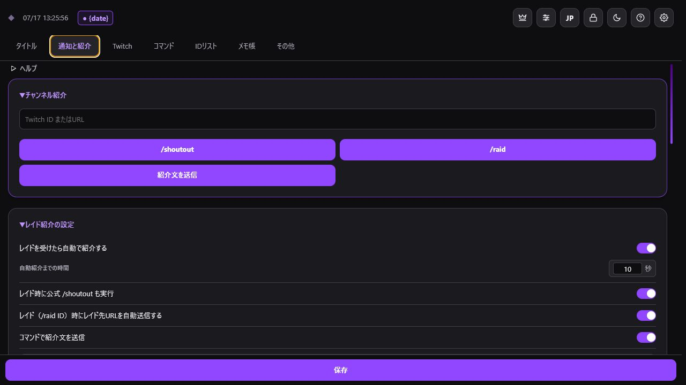
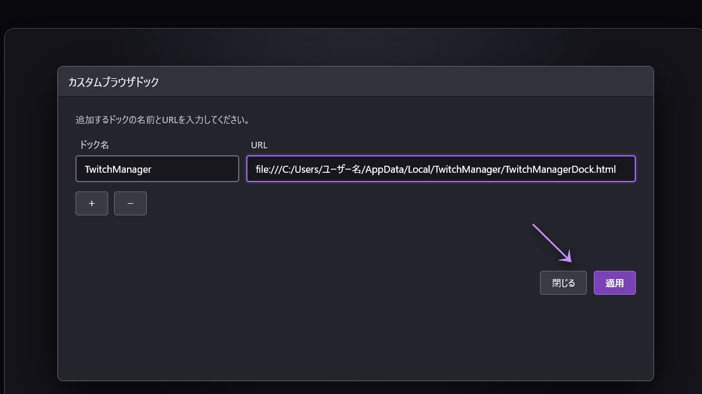

# TwitchManager

OBS Studioの画面から、Twitch配信の準備・操作・記録をまとめて行えるカスタムブラウザドックです。

> 現在の開発版は **0.9_beta** です。正式版 **1.0.0** は2026年7月25日に公開予定です。  
> TwitchおよびOBS Studioの公式ツールではありません。



## はじめての方へ

GitやGitHubの知識は必要ありません。次の順に進めてください。

1. [Releases（ダウンロードページ）](https://github.com/MagnestGames/TwitchManager/releases)を開きます。
2. 一番上にある使用したいバージョンの **Assets** を開きます。
3. Windows 11は `TwitchManager-Windows11-Setup.exe`、macOSは `TwitchManager-macOS.pkg` をダウンロードします。
4. インストール後、下の「OBS Studioへ追加する」へ進みます。

`Source code (zip)`、`Source code (tar.gz)`、画面上部の緑色の **Code** ボタンは、通常のインストールには使いません。

## TwitchManagerでできること

- 配信タイトルとカテゴリの保存・反映
- レイド受信時の自動紹介と公式 `/shoutout`
- 配信先への `/raid` とレイド先URLの自動送信
- 初見、レイド、フォロー、Bits、サブスク、チャット、ポイント引き換えの記録
- 予測、投票、チャット設定、クリップ、VIPの操作
- 通知音、配信者IDリスト、誕生日・記念日、メモ、バックアップ

詳しい機能は[機能一覧（Wiki）](https://github.com/MagnestGames/TwitchManager/wiki/Feature-Overview)で確認できます。

## 対応環境

| OS | 対応 |
| --- | --- |
| Windows | Windows 11 |
| macOS | macOS 11以降 |

OBS Studioの「カスタムブラウザドック」を使用します。

## インストール

### Windows 11

1. `TwitchManager-Windows11-Setup.exe` を開きます。
2. インストール先を確認し、「インストール」を押します。
3. 完了画面で、OBS用URLがクリップボードへコピーされたことを確認します。

既定のインストール先は、Windowsの **ドキュメント** フォルダ内にある `TwitchManager` です。  
OBS用URLは、インストール先の `OBS_Dock_URL.txt` でも確認できます。

### macOS

1. `TwitchManager-macOS.pkg` を開いてインストールします。
2. `/Applications/TwitchManager` にある「TwitchManagerをOBSに追加」を開きます。
3. OBS用URLがクリップボードへコピーされたことを確認します。

OBS用URLは `/Applications/TwitchManager/OBS_Dock_URL.txt` でも確認できます。

### 「開発元を確認できません」などの警告が出る場合

現在のインストーラーには有料のコード署名を付けていません。ダウンロードしたファイルがRelease作成時のファイルと同じか、同じAssetsにある `.sha256` ファイルで確認できます。

Windows PowerShellでの確認例:

```powershell
Get-FileHash "$env:USERPROFILE\Downloads\TwitchManager-Windows11-Setup.exe" -Algorithm SHA256
```

macOSのターミナルでの確認例:

```sh
shasum -a 256 ~/Downloads/TwitchManager-macOS.pkg
```

表示された64文字の値が `.sha256` 内の値と完全に同じであることを確認してください。一致しない場合は実行せず、ファイルを削除してダウンロードし直してください。

> SHA256はファイルの破損や差し替わりの確認に使えますが、配布者の身元を証明するコード署名ではありません。

## OBS Studioへ追加する

1. OBS Studio上部の「ドック」から「カスタムブラウザドック」を開きます。


2. 必要なら「＋」で行を追加します。
3. ドック名に `TwitchManager` と入力します。
4. URL欄に、インストール時にコピーされたOBS用URLを貼り付けます。
5. 「適用」を押します。



追加されたドックは、ドラッグして好きな位置へ置けます。文字やボタンが切れる場合は、ドックの幅を広げてください。

最後に、TwitchManager右上の歯車からTwitch認証を設定します。手順は[Twitch認証（Wiki）](https://github.com/MagnestGames/TwitchManager/wiki/Authentication)を参照してください。

## データの保存とバックアップ

設定やリストは、TwitchManagerを表示しているOBSまたはブラウザ内に保存されます。PC移行、OBSのキャッシュ削除、再インストールの前に、「その他」タブからバックアップをコピーしてください。

アクセストークンを配信画面、GitHubのIssue、SNSなどへ載せないでください。

## 困ったとき

- [インストールとOBSへの追加](https://github.com/MagnestGames/TwitchManager/wiki/Getting-Started)
- [よくある質問](https://github.com/MagnestGames/TwitchManager/wiki/Q&A)
- [トラブルシューティング](https://github.com/MagnestGames/TwitchManager/wiki/Troubleshooting)
- 解決しない場合は[Issues](https://github.com/MagnestGames/TwitchManager/issues)で報告してください

不具合報告には、OS、OBS Studioのバージョン、TwitchManagerのバージョン、再現手順、表示されたエラーを記載してください。アクセストークンなどの秘密情報は貼り付けないでください。

## バージョンについて

| 種類 | 例 | 用途 |
| --- | --- | --- |
| 開発版 | `0.9_beta` | `dev`で修正を集め、公開前に確認する版 |
| 正式版 | `1.0.0` | `main`で公開する最初の正式版 |
| 軽微なバグ修正 | `1.0.1` | 機能を変えない修正版 |
| 機能追加 | `1.1.0` | 後方互換性を保った機能追加版 |

開発版は `X.X_beta` の2桁、正式版は `X.Y.Z` の3桁で管理します。現在の開発版ブランチは `0.9_beta`、正式版1.0.0の公開予定日は2026年7月25日です。

## ライセンス

[MIT License](LICENSE)
