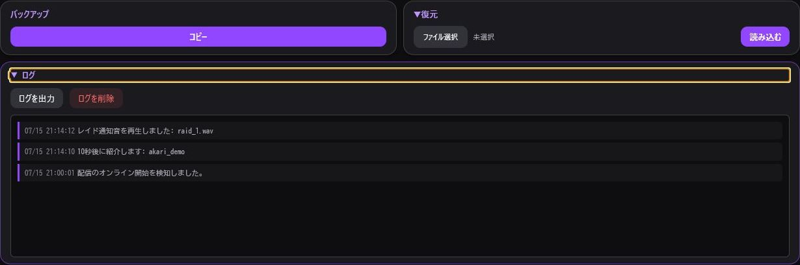

> 🌐 **Language / 語言:** **🇯🇵 日本語** | [🇺🇸 English](Memo-and-Other-EN) | [🇨🇳 简体中文](Memo-and-Other-ZH)

---

# メモ帳・その他

## メモ帳（固定ツールバー付きマークダウンエディタ）

配信準備やゲーム進行、コラボ当日の流れをメモカードとして保存・編集できます。


### 主な機能・特徴

- **固定ツールバー（Sticky Header）**:
  - メモ編集画面の上部にフォーマット編集ツールバーが常時固定表示されます。
  - 太字（`**`）、斜体（`*`）、見出し（`#`）、引用（`>`）、コードブロック（```）、リンク、タスクリスト（`- [ ]`）をワンタップで挿入できます。
- **インタラクティブタスクリスト**:
  - プレビュー表示のまま、画面上のタスクチェックボックスを直接クリックしてON/OFF完了状態を切り替えられます。
- **自動連番＆多階層ネスト対応**:
  - 番号付きリスト（`1. `, `2. `）の自動カウントアップ。
  - `Tab` / `Shift+Tab` キーによる最大3階層のリストインデント（ネスト）に対応。

### 活用例

- 配信中に話すアジェンダ・トピック
- ゲームの攻略メモ・進行チャート
- コラボ当日のタイムスケジュール
- 企画で使用するリンク・台本

---

## バックアップ・復元



データの退避と移行を行います。詳しくは [設定・バックアップ](Settings-and-Backup) を参照してください。

---

## イベントログ

Twitch認証、レイド通知、チャンネルポイント操作、コマンド実行などの各種動作ログを確認できます。お問合せ時にエラーログを保存・確認できます。
