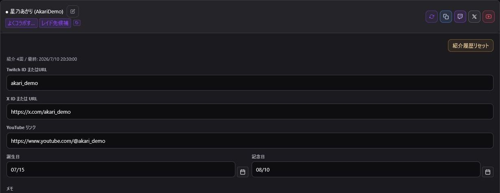

> 🌐 **Language / 語言:** **🇯🇵 日本語**

---

# TwitchManager 1.0.3 リリース案内

> 公開日: 2026年8月28日
> 対象: Windows 11 / macOS 11以降

1.0.3では、配信準備用データの管理、チャンネルポイント操作、メモ、バックアップ、狭いOBSドックでの表示を更新します。

## アップデート前の確認

1. 右上の歯車アイコンを開きます。
2. 「バックアップ」で現在の設定を保存します。
3. TwitchManagerとOBSを終了します。
4. 1.0.3のインストーラーを実行し、現在と同じ場所へ上書きします。
5. OBSを起動し、認証状態、タイトル、IDリスト、通知設定を確認します。

認証情報はバックアップの対象外です。別のPCへ移行した場合は、移行先でTwitch認証を行ってください。

## 配信タイトルと動的タグ

- `{date}`: 現在の日付
- `{Category}`: 登録したカテゴリ名への変換
- `{count}`: 配信回数
- `{コラボ}`または登録したグループ名: IDリストの参加者
- カードのピン留め、表示切り替え、一括開閉

Twitchへ反映される内容は、送信前のプレビューで確認してください。詳しい操作は[タイトル管理](Stream-Title)を参照してください。

## IDリストと記念日管理

- 登録グループの置換タグと `@ID` 一覧を個別にコピー
- 大文字・小文字の違いを含む重複Twitch IDの確認と統合
- ピン留め、並び替え、誕生日・記念日カレンダー

統合前に表示名、SNS、メモ、誕生日・記念日を確認してください。詳しくは[IDリスト](ID-List)を参照してください。

## チャンネルポイント管理

- 報酬のON/OFF、一時停止、再開
- グループ単位の操作と配信状態に応じた自動切り替え
- 色、ポイント数、コメント必須設定の一括編集
- 報酬IDのコピーと登録済み報酬アイコンの表示

編集・削除できるのは、原則としてTwitchManagerから作成したカスタム報酬です。Twitch公式の自動報酬やPower-upsは対象外です。詳しくは[Twitch機能](Twitch-Tools)を参照してください。

## Markdownメモ

- 固定ツールバーから見出し、リスト、リンク、引用、コードを入力
- 編集とプレビューの切り替え
- プレビュー上で操作できるタスクリスト
- 番号付きリストと最大3階層のネスト

詳しくは[メモ帳・その他](Memo-and-Other)を参照してください。

## バックアップと復元

- 保存対象を選択したJSONバックアップ
- 現在のデータを置き換える「完全上書き」
- 現在のデータを保持して追加する「差分統合（マージ）」
- JSONおよびTXTファイルからの復元
- 不正なファイルを拒否し、失敗時は変更前の状態へ戻す復元処理

復元前にも現在のデータをバックアップしてください。詳しくは[設定・バックアップ](Settings-and-Backup)を参照してください。

## 狭いOBSドックでの表示

幅480px以下ではボタン、カード、設定項目を折り返して表示します。幅300px以下ではヘッダーを複数行へ配置します。表示が更新されない場合は、OBSドックを右クリックして再読み込みするか、`Ctrl+R`を押してください。

## レイド失敗表示の多言語対応

レイド開始に失敗した際のTwitch APIエラーを、日本語・英語・簡体中国語の選択中の言語で表示するよう修正しました。アウトバウンドレイドのイベントログも選択中の言語で表示します。

## 更新後の確認

- Twitch認証アカウントが正しい
- タイトルカードとIDリストが表示される
- 通知音の出力先と音量が正しい
- チャンネルポイント報酬を取得できる
- バックアップを新規作成できる

問題がある場合は、認証情報を含めず、OS、OBSのバージョン、発生手順、発生時刻、イベントログを添えて報告してください。
