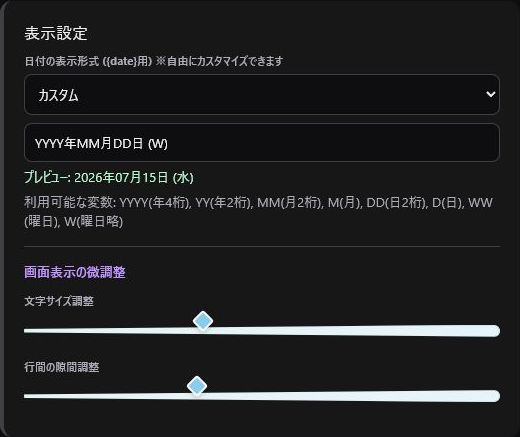

> 🌐 **Language / 語言:** **🇯🇵 日本語** | [🇺🇸 English](Settings-and-Backup-EN) | [🇨🇳 简体中文](Settings-and-Backup-ZH)

---

# 設定・バックアップ

右上の歯車アイコンで共通設定の変更とバックアップ・復元を行います。

## Twitch認証

トークンの保存、連携アカウントの確認、認証解除を行います。詳しくは [Twitch認証](Authentication) を参照してください。

## 表示設定

日付形式、文字サイズ、行間を変更できます。日付形式は画面上部および `{date}` タグの置換テキストに即時反映されます。

## 配信管理設定

- **自動広告**: 配信開始時に3分間の広告を自動実行（初期値: OFF）
- **自動ピン留め**: 紹介・レイドメッセージをチャット上部に20分間自動ピン留め

## 機能ブロックの表示設定

「通知と紹介」「Twitch」「コマンド」の各機能の表示・非表示を切り替えられます。非表示にしても内部データは削除されません。

---

## 選択的バックアップとスマート復元エンジン

保存データの退避・環境移行・PC復旧を行うための高度なバックアップ機能を搭載しています。

### 1. 選択エクスポート（Selective Backup）

バックアップ保存時、以下のデータドメインを個別に選択して保存できます：
- 全データ（完全バックアップ）
- タイトル一覧（カテゴリ、配信タイトルカード、単語セットタグ設定 `{count}` 含む）
- IDリスト（コラボ相手、グループ）
- メモ帳
- 配信管理・通知設定

### 2. 2種類の復元モード（完全上書き vs 差分統合マージ）

バックアップファイルの読み込み時、用途に合わせて復元方法を選択できます。

- **完全上書き**:
  - 現在のデータをクリアし、バックアップファイルの内容で完全に置き換えます。データのリセットやPC移行時に最適です。
- **差分統合（マージ）**:
  - 既存のデータを保持したまま、バックアップファイル内の新しいカードや設定のみを非破壊で合成・追加します。複数の環境の統合や、カテゴリの追加に最適です。

### 3. `.txt` プレーンテキストファイル復元対応

`.json` ファイルに加えて、`.txt` ファイルの読み込みにも完全対応しています。
- メモ帳等で作成したタイトルリスト行（`ゲーム名 | タイトル名`）や、`@TwitchID` のテキストリストを自動解析し、タイトルカードやIDリストとしてスムーズにインポート可能です。
- Windowsのファイル選択画面では、`.json` と `.txt` が最初から並列で一括表示されます。

> 💡 **安全のためのアドバイス**: データ復元を行う直前にも、必ず「現在のデータのバックアップ」を作成しておくことをおすすめします。
