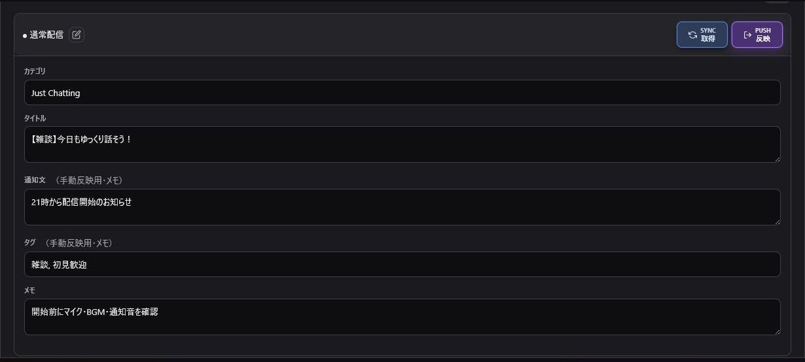

> 🌐 **Language / 語言:** **🇯🇵 日本語** | [🇺🇸 English](Stream-Title-EN) | [🇨🇳 简体中文](Stream-Title-ZH)

---

# タイトル管理

配信タイトルとカテゴリ（ゲーム名等）をカードとして保存し、1タップでTwitchへ反映・自動変換する高度なタイトル置換エンジンです。

## 基本的な使い方

1. **カテゴリ・テンプレートの作成**: 「＋ テンプレートを追加」をクリックし、ゲーム名や企画ごとのグループを作成します。
2. **カードの追加**: テンプレート右上の「＋」で配信タイトルカードを追加します。
3. **タイトルとゲーム名の設定**: ゲームカテゴリと配信タイトルを入力して保存します。

> 💡 **ポイント**: 通知文、タグ、メモは配信準備用の控え（メモ）です。Twitchへ直接送信・反映されるのは「配信タイトル」と「ゲームカテゴリ」です。

## 同期と反映

- **「同期」**: Twitchの現在の配信タイトルとゲームカテゴリを読み込みます。
- **「反映」**: 選択したカードの内容を即座にTwitchへ送信して更新します。

※ カテゴリはTwitchの正式名称が必要です。最初にTwitch側で設定して「同期」を押すと、正確な名称が読み込まれて入力ミスを防げます。

---

## 共有共通タグバー（Common Tag Bar）と動的タグ置換エンジン

ヘルプセクション下部の「共有共通タグバー」を使うと、配信タイトル内に記述されたタグ文字列が、送信・コピー時に自動的に動的テキストへ変換されます。

### サポートされている動的タグ一覧

| タグ記法 | 展開内容 | 説明 |
| :--- | :--- | :--- |
| `{date}` | 今日の日付・曜日 | 表示設定で指定したフォーマット（例: `2026/08/21(金)`）に自動変換されます。 |
| `{Category}` | ゲームカテゴリ変換 | 指定したゲーム名やエイリアスを自動変換ルールに基づいて置換します。 |
| `{count}` | 配信回数カウンター | 通算配信回数（例: `5`）に自動置換されます。配信更新ごとに自動カウントアップ可能。 |
| `{コラボ}` / `{グループ名}` | 参加メンバーの `@ID` | IDリストの該当カテゴリに登録されたメンバーのTwitch ID（例: `@user1 @user2`）に自動置換されます。 |

### 単語セット＆カスタムタグ登録モーダル

「単語セット・タグ設定」モーダルでは、独自の自動置換ルールやゲームカテゴリ変換マップを作成できます。

- **自動整形ルール**: タグ名入力時、絵文字・記号・スペースは安全のため自動的に除去されます。
- **ゲームカテゴリ変換マッピング（エイリアス設定）**: 
  - 『逆転裁判』シリーズ等のプリセット登録に対応。
  - 手動入力された略称や表記揺れ（例: `逆転裁判1` → `逆転裁判 蘇る逆転`）を優先変換するルールを作成可能です。

---

## 注意事項・小技

- **OBSの画面反映について**: OBS標準の配信情報ドックが更新されない場合は、ドックを右クリックして再読み込みするか `Ctrl+R` を押してください。
- **並び替えと編集**: カード名は鉛筆ボタンでいつでも変更できます。並び替えや削除は、配信中の誤操作を防ぐため配信開始前に行ってください。
