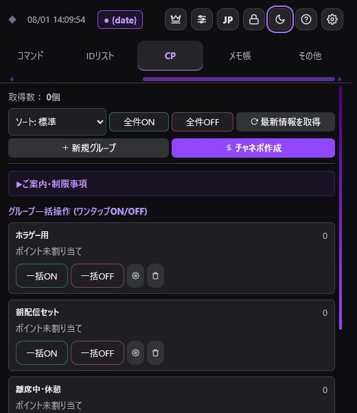
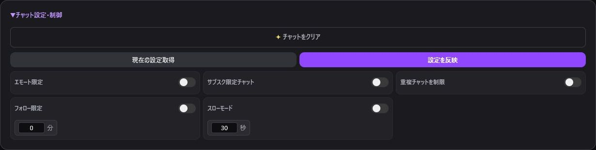
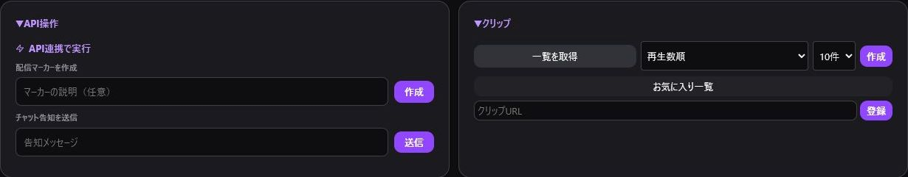

> 🌐 **Language / 語言:** **🇯🇵 日本語** | [🇺🇸 English](Twitch-Tools-EN) | [🇨🇳 简体中文](Twitch-Tools-ZH)

---

# Twitch連携機能

「Twitch」タブには、配信中・配信後に活用できる多彩なTwitch API連携機能が揃っています。

## チャンネルポイント管理（高度なコントロール＆一括編集）

取得したチャンネルポイント報酬の確認、ON/OFF切り替え、一時停止、一括編集、グループ分けを管理します。

### 主な機能・特徴

- **報酬アイコン表示**: Twitch標準およびカスタム報酬の実際のアイコン画像を表示します。
- **一時停止/再開（Pause / Resume）コントロール**:
  - 各報酬カードおよびグループに黄色の「一時停止/再開」切り替えボタンを搭載。
  - 報酬を削除・無効化することなく、一時的に交換をサスペンドできます。
- **一括編集（Bulk Edit）モーダル**:
  - 複数選択した報酬に対して「ON/OFF」「一時停止」「背景色（EyeDropper/スポイト機能・使用中カラーパレット）」「必要ポイント（コスト）」「視聴者コメント要求（テキスト入力）」を一括更新できます。
- **配信終了時自動OFF（Auto-OFF on Stream End）**:
  - 配信終了イベントを検知して特定のグループ（例: 配信中限定ポイント）を自動的にOFFへ切り替えます。
- **Reward ID コピー機能**:
  - 各報酬の内部Reward IDの確認および1タップコピーが可能です。

> ⚠️ **Twitch APIの制限事項・Power-upsについて**:
> Twitch APIの仕様により、一括操作やTwitchManagerからの編集・削除を行えるのは「TwitchManager（本アプリ）で作成したカスタム報酬」のみです。Twitch公式管理画面で作成された標準報酬や「Power-ups（Twitch公式パワーアップ機能）」は表示・一部連携のみとなります。

---

## Twitch画像リサイズツール（Twitch Image Resizer）連携

チャンネルポイントアイコンやサブスクバッジ・エモートの作成を支援する外部ツール「Twitch Image Resizer」へのワンタップアクセスボタンが追加されました。最適な解像度（28x28 / 56x56 / 112x112等）に画像を自動変換できます。

---

## サポーターリスト

初見、レイド、フォロー、Bits、サブスク、ギフト、チャット、チャンネルポイント引き換えを集計し、お礼文としてワンタップコピーします。

ポイント引き換えには、カスタム報酬に加えて、スタンプ巨大化、メッセージエフェクト、画面全体のお祝い、メッセージ強調などの自動報酬も記録されます。Twitchのパワーアップで使われたBitsも「ビッツ（Cheer）」へ反映されます。

不要な項目と自動応答用アカウントを除外し、配信開始時の自動リセットを設定できます。「過去ログを開く」から、保存された以前の集計を確認できます。

---

## 予測・投票

- **予測**: 2～10件の選択肢、30～1800秒
- **投票**: 最大5件の選択肢、15～1800秒
- 作成、取得、終了、プリセット保存に対応。

---

## チャット設定

チャットクリア、エモート限定、サブスク限定、重複制限、フォロー限定、スローモードをワンクリックで操作できます。

---

## API操作・クリップ

配信マーカーと告知メッセージを作成できます。クリップは作成、一覧取得、お気に入り登録に対応しています。

---

## コラボURL生成

複数のTwitch IDから、multistre.am または TwitchTheater の同時視聴URLを自動生成します。

---

## サブスクライバー・VIP管理

サブスクライバー一覧の取得、VIP一覧・残枠の確認、ID入力によるVIP追加・削除を行えます。

機能ごとに必要な権限（Scope）が異なります。操作時にエラーが発生する場合は [Twitch認証](Authentication) とイベントログをご確認ください。
